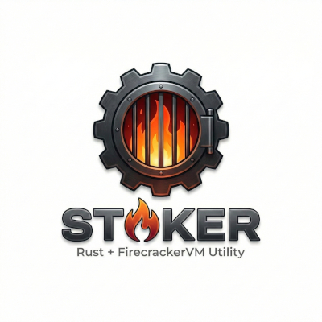
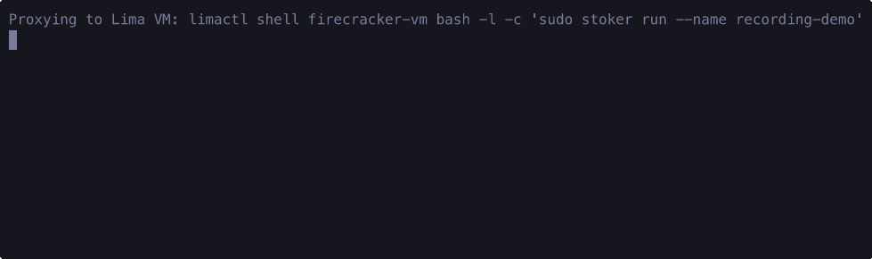
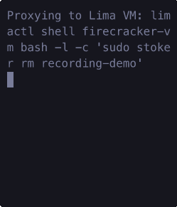
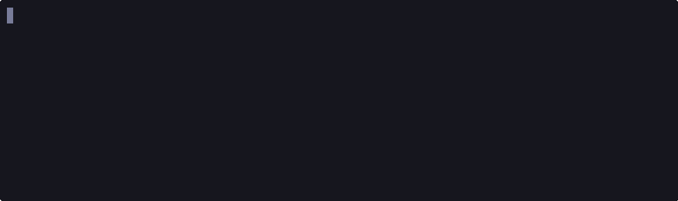

# Stoker



**Stoker** is a lightweight, natively compiled command-line interface written in Rust designed to mimic Docker for managing Firecracker MicroVMs.

It transparently bridges the gap between macOS and Linux by automating the provisioning of a hidden Lima hypervisor backend, bridging isolated TAP network interfaces, and deploying isolated lightweight Firecracker instances locally.

## Features

- **End-to-End macOS Support**: Run `stoker setup` to automatically provision a hidden, transparent Linux hypervisor (Lima) to run Firecracker natively on macOS. 
- **Docker-like UX**: Leverage commands like `run`, `list`, `rm`, and `ssh` natively without dealing with low-level `.socket` or MAC address bindings.
- **Dynamic Networking**: Unique pseudo-containers get isolated `/30` TCP/IP network interfaces bridged into the host.
- **Custom Image Building**: Use `stoker build` to expand and bake offline ext4 file systems natively via `systemd-nspawn` just like `docker build`.

## Getting Started

### Prerequisites

For macOS, you will need Homebrew to install the underlying Lima Hypervisor proxy requirements.
If you are already on Ubuntu/Linux, `stoker` works immediately out of the box using KVM!

```bash
brew install lima
```

### Building & Installing

Clone the repository and install `stoker` locally to your `$PATH` via Cargo:

```bash
cargo install --path . --force
```

### 1. Initializing the Virtualized Backend (macOS Only)

If you are on macOS, `stoker` acts as a proxy to a transparent Linux host where the KVM virtualization runs. You must initialize it first:

```bash
stoker setup
```
*(This will download an Ubuntu image, install necessary kernel modules, enable nested KVM, and compile/install `stoker` internally into the proxy.)*

### 2. Downloading Base Assets

Before booting a MicroVM, you must pull down a valid Ubuntu Ext4 rootfs and a compiled Linux kernel. `stoker` handles this seamlessly:

```bash
stoker download-assets
```
*(Assets are cached inside `~/firecracker-assets` natively on the Linux backend.)*

---

## Usage Guide

### Running a MicroVM

Similar to `docker run`, booting a new Firecracker microVM instance is virtually instant:



```bash
stoker run --name my-server
```

This will automatically:
1. Allocate an offline TAP interface and generate a pseudo MAC address.
2. Bridge the TAP interface to the host NAT allowing outward internet.
3. Spawn a dedicated `firecracker` daemon.
4. Pass the network payloads and boot actions over the Unix Socket dynamically.
5. Provide you with the isolated IP address (e.g. `172.16.0.2`).

### Connecting to a MicroVM

Because `stoker run` establishes a daemon in the background with full NAT capabilities, you can interface natively utilizing automatic RSA proxying:


```bash
stoker list
# CONTAINER ID         IMAGE           STATUS          NAMES                IP             
# fc_00                ubuntu:24.04    Up              my-server            172.16.0.2     

stoker ssh my-server
# Connecting to stoker-my-server at 172.16.0.2...
# root@my-server:~#
```

### Removing a MicroVM

When you are finished, you can cleanly tear down the networking TAP devices and Firecracker Unix sockets:



```bash
stoker rm my-server
```

### Listing Images

You can view the custom `.ext4` offline root filesystems you have built natively using `stoker images`:



```bash
stoker images
# IMAGE                          SIZE           
# ubuntu-rootfs                  200.00 MB      
# nginx-server                   2248.00 MB
```

### Building Custom Images (`stoker build`)

Using `stoker build`, you can seamlessly bake specialized offline `.ext4` footprints natively using `systemd-nspawn` before booting, perfectly emulating traditional Dockerfiles!

```bash
# Provide a bash script to execute inside the chroot sandbox:
stoker build --image-name nginx-server --script-path ./install_nginx.sh

# Run the produced natively packed image:
stoker run --name web --image nginx-server
```
